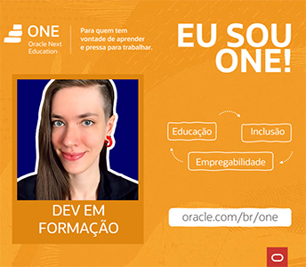

# ORACLE NEXT EDUCATION - 2022 TURMA #3

Em parceria com a Alura, a Oracle disponibiliza um programa de educação dividido em quatro trilhas: Lógica de Programação, Front-end, Java e Empreendedorismo.

Este bootcamp possui duração de de 6 meses, somando um total de 420 horas de conteúdo.

## Ementas e projetos

- [ ] [Ementa](./ementa.md)